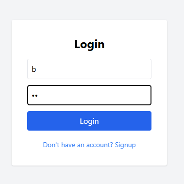
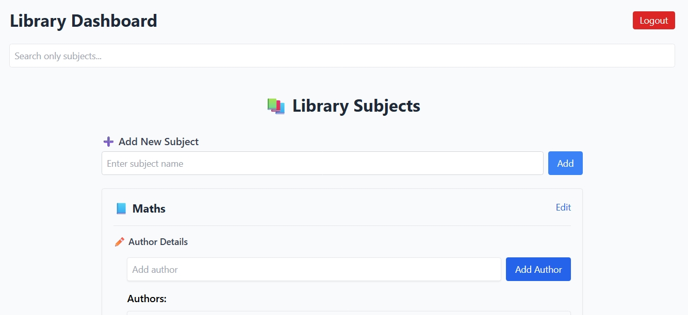

# Getting Started with Create React App (CRA)

This project was bootstrapped with [Create React App](https://github.com/facebook/create-react-app), using the [Redux](https://redux.js.org/) and [Redux Toolkit](https://redux-toolkit.js.org/) TS template.

# Library Management System

A simple React + Redux Toolkit application to manage a library of **Subjects**, **Authors**, and **Books**.  
You can add, edit, and search for subjects, authors, and books. All data is persisted in browser's localStorage.

---

## Features

- **Add/Edit Subjects**
- **Add/Edit Authors** (under each subject)
- **Add/Edit Books** (under each author)
- **Search Bar**: Filter by subjects only
- **Persistent Storage**: Data saved in localStorage

---

## Screenshots

<!-- Add your screenshots below. Example: -->





---

## Getting Started

### Prerequisites

- Node.js (v16 or higher recommended)
- npm or yarn

### Installation

1. **Clone the repository:**

   ```sh
   git clone https://github.com/bhavna-chandera/library-management.git
   cd library_management
   ```

2. **Install dependencies:**

   ```sh
   npm install
   # or
   yarn install
   ```

3. **Start the development server:**

   ```sh
   npm start
   # or
   yarn start
   ```

4. Open [http://localhost:3000](http://localhost:3000) in your browser.

---

## Project Dependencies

- library_management@0.1.0
- ├── @reduxjs/toolkit@2.8.2
- ├── @tailwindcss/postcss@4.1.11
- ├── @testing-library/jest-dom@6.6.4
- ├── @testing-library/react@16.3.0
- ├── @testing-library/user-event@14.6.1
- ├── @types/react-router-dom@5.3.3
- ├── autoprefixer@10.4.21
- ├── cra-template-redux-typescript@2.0.0
- ├── postcss@8.5.6
- ├── react@18.3.1
- ├── react-dom@18.3.1
- ├── react-redux@9.2.0
- ├── react-router-dom@7.7.1
- ├── react-scripts@5.0.1
- └── tailwindcss@3.4.17

- npm install @reduxjs/toolkit @tailwindcss/postcss @testing-library/jest-dom @testing-library/react @testing-library/user-event @types/react-router-dom autoprefixer cra-template-redux-typescript postcss react react-dom react-redux react-router-dom react-scripts tailwindcss

  - or

- yarn add @reduxjs/toolkit @tailwindcss/postcss @testing-library/jest-dom @testing-library/react @testing-library/user-event @types/react-router-dom autoprefixer cra-template-redux-typescript postcss react react-dom react-redux react-router-dom react-scripts tailwindcss

## Search functionality

- The search bar filters the list of subjects
- You can search by **subject name**.

---

## Credits

- Built with [React](https://react.dev/) and [Redux Toolkit](https://redux-toolkit.js.org/).
